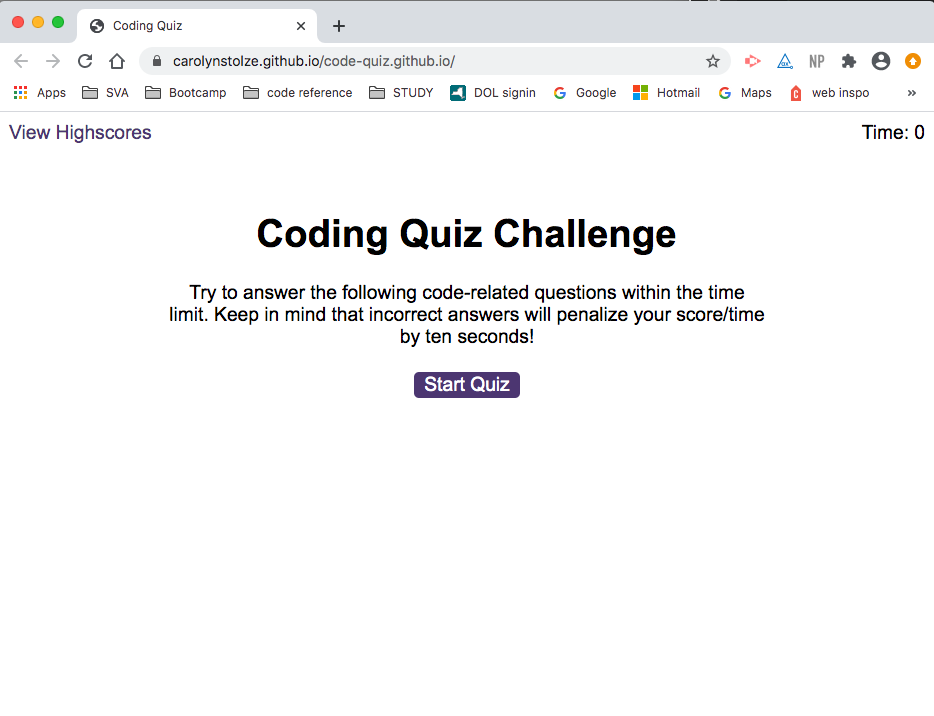

# code-quiz

LIVE SITE:
https://carolynstolze.github.io/code-quiz.github.io/

GITHUB REPOSITORY:
https://github.com/carolynstolze/code-quiz




- - -
- - -

## A timed quiz on JavaScript fundamentals which stores high scores so you can gauge your progress compared to others.

- - -
- - -

```
## commit 1
- initial push: files copied from homework assignment. No code added.

## commit 2
- updated logic.js file with working startQuiz function and getQuestion function.

## commit 3
- updated logic.js file 
    - updated functions: startQuiz, getQuestion
    - new working functions: questionClick, quizEnd, clockTick

## commit 4
- working code quiz
    - updated logic.js and scores.js